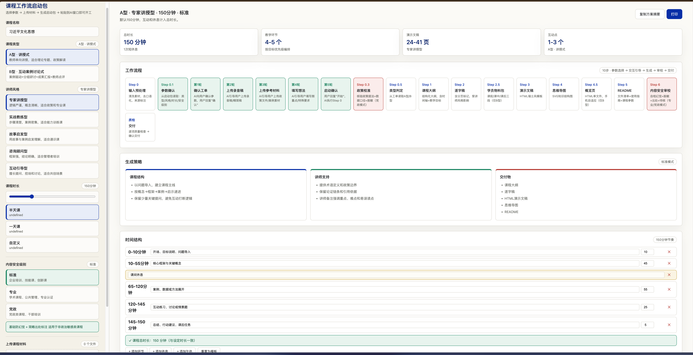

# Course Workflow Kickstart · 课程工作流启动包

**[English](#english) | [中文](#中文)**

> Zero install · Zero AI dependency · Zero network — A course production kickstart tool that runs in your browser.

**[>> Live Demo <<](https://ai-nande.github.io/course-workflow-kickstart/)**

---

<a id="english"></a>

## What is this

A pure front-end HTML tool that helps you configure parameters and confirm materials before generating a course. It produces a structured **AI Execution Protocol Package** (Prompt + interaction script + quality standards) that you copy-paste into any AI chat window to kickstart a complete course production workflow.

**The panel itself does not call AI or connect to the internet.** Its output is plain text — a protocol package that any AI can follow.

## Key Features

| Feature | Description |
|---------|-------------|
| Parameter Selection | Course type (lecture / interactive discussion), instructor style, duration, B-type defaults |
| Content Safety Levels | 3 presets: Standard / Professional / Government (desensitization + strict sourcing + secondary review) |
| Timeline Editor | Fine-tune segment durations, add/remove sessions; lunch break excluded from course time |
| File Upload | Drag-and-drop transcripts / reference materials with local preview |
| Kickstart Generation | Outputs 5-round interaction script + workflow instructions + quality checklist |
| Preview + Copy + Download | Full-text preview before generation, one-click clipboard copy or .txt download |

## Screenshot



## Quick Start

### Option 1: Live Demo (Recommended)

Visit **[ai-nande.github.io/course-workflow-kickstart](https://ai-nande.github.io/course-workflow-kickstart/)** — full functionality in your browser, no download needed.

### Option 2: Local Use

1. Download `index.html`
2. Open it in a browser (double-click)
3. Select parameters → upload files → click "Generate Course Kickstart"
4. Copy the generated text and paste it into any AI chat window
5. The AI follows the interaction script to guide you through uploading materials round by round, then executes the course production

## Workflow Overview

```
Step 0    Input Preprocessing (Tier1 full / Tier2 transcript only / Tier3 minimal)
Step 0.1  Parameter Selection + 5-round Interaction Guide (panel generates, AI executes)
Step 0.3  Policy Calibration (Standard: skip / Professional: optional / Government: mandatory)
Step 0.5  Type Determination (read A/B type from kickstart)
Step 1    Outline Generation → User Confirmation
Step 2    Verbatim Script Generation (with [PAGE X] markers)
Step 2.5  Student Material Pack (B-type only, printable Markdown)
Step 3    HTML Presentation Generation (Swiss-style template)
Step 4    Mind Map Generation (SVG)
Step 4.5  Course Overview Page (HTML, for external display)
Step 5    README
Step 6    Content Safety Review (Standard: skip / Professional: optional / Government: mandatory)
```

### Type A vs Type B

| | Type A · Lecture | Type B · Interactive Discussion |
|---|---|---|
| Deliverables | 4 | 6 |
| Extra Outputs | — | Student Material Pack + Course Overview Page |
| Default Params | — | 4 groups, 3 rounds, 4 roles |

## Content Safety Levels

| Level | Anti-Hallucination | Source Attribution | Desensitization | Secondary Review | Use Case |
|-------|-------------------|-------------------|-----------------|------------------|----------|
| Standard | Basic | 3-level brief | No | No | Corporate training, skill courses |
| Professional | Strict | 5-level + source fields | No | Optional | Academic courses, public administration |
| Government | Strict | 5-level + source fields + links | Mandatory | Mandatory | Government courses, cadre training |

### Source Attribution System

| Tag | Meaning | Source Requirement |
|-----|---------|-------------------|
| `[Original]` | Verbatim from transcript | Filename + paragraph number |
| `[Adapted]` | Rewritten from transcript | Filename + paragraph number |
| `[Cited]` | Quoted from policy document | Filename + date + paragraph / URL |
| `[Added]` | Supplementary content | Source name + date / URL |
| `[Unverified]` | Cannot be confirmed | Marked "requires manual verification" |
| `[Redacted]` | Omitted for security | Original type noted (Government level only) |

## Project Structure

```
course-workflow-kickstart/
├── index.html                  # Main entry · parameter panel (single file, open in browser)
├── README.md                   # Project documentation (this file)
├── ARCHITECTURE.md             # Technical architecture & design decisions
├── assets/
│   └── screenshot.png          # UI screenshot
├── .gitignore
└── docs/
    └── workflow-spec-v1.2.md   # Standardized production workflow specification
```

## Technical Highlights

- **Single-file HTML**: No build step, no dependencies — download and use
- **Pure front-end**: All logic runs locally in the browser, no data sent to any server
- **Cross-AI platform**: Generated kickstart can be pasted into ChatGPT, DeepSeek, Qwen, WorkBuddy, or any AI window
- **Clipboard fallback**: `navigator.clipboard` with automatic fallback to `execCommand('copy')` for `file://` protocol
- **GitHub Pages**: Online version available without download

## Use Cases

- Government courses / cadre training (enable Government-level safety mode)
- Corporate training / innovation courses (Standard mode)
- Academic courses / professional certification (Professional mode)
- Any scenario requiring a structured course production workflow

## Relationship with Similar Projects

This tool focuses on course **production** (instructor → AI → course materials), complementing course **delivery** platforms like [AI-Shifu](https://github.com/ai-shifu/ai-shifu) (platform → learners):

| Dimension | This Project | AI-Shifu |
|-----------|-------------|----------|
| Stage | Course Production | Course Delivery |
| AI Location | External (any AI window) | Embedded (server-side) |
| Deployment | Zero-install / online | Docker + MySQL |
| Output | Outline / script / slides / mind map / material pack | In-platform course content |
| Content Safety | 3 presets (incl. government desensitization) | — |

Can be used in sequence: produce course content with this tool, then import into a delivery platform for personalized teaching.

## Roadmap

### v1.2 (Current)
- [x] Parameter panel (Type A/B, style, duration, safety level)
- [x] Editable timeline structure
- [x] File upload with local preview
- [x] 5-round interaction script generation
- [x] 3-tier content safety presets
- [x] 5-level source attribution system
- [x] GitHub Pages live demo

### v1.3 (Planned)
- [ ] Course template library (preset common course type templates)
- [ ] Parameter config save/load (localStorage)
- [ ] Multilingual UI (CN/EN)
- [ ] Mobile responsive optimization

### v2.0 (Long-term)
- [ ] Course quality scoring system
- [ ] Team collaboration mode (multi-person parameter negotiation)
- [ ] Course asset version management
- [ ] TTS voice output (script → audio)

## License

MIT

---

<a id="中文"></a>

## 这是什么

一个纯前端 HTML 工具，帮你在生成课程前完成参数配置和材料确认，一键生成结构化的 **AI 执行协议包**（Prompt + 交互脚本 + 质量标准），复制粘贴到任何 AI 对话窗口即可启动完整的课程生产工作流。

**面板本身不调用 AI，不联网。** 它的产出是一段文本——一份让任何 AI 都能按协议执行的指令包。

## 核心功能

| 功能 | 说明 |
|------|------|
| 参数选择 | 课程类型（讲授式 / 互动讨论式）、讲师风格、课程时长、B型默认参数 |
| 内容安全级别 | 3档预设：标准 / 专业 / 党政（脱敏+严格出处+二次审校） |
| 时间结构编辑 | 可微调每段时长、增删环节、午休分隔不计入课程时长 |
| 文件上传确认 | 拖拽上传录音稿/参考材料，本地预览文件摘要 |
| 生成启动包 | 输出含5轮交互引导脚本 + 工作流指令 + 质量检查清单的完整文本 |
| 预览 + 复制 + 下载 | 生成前预览全文，支持一键复制剪贴板或下载 .txt 文件 |

## 界面预览


## 快速开始

### 方式一：在线试用（推荐）

直接访问 **[ai-nande.github.io/course-workflow-kickstart](https://ai-nande.github.io/course-workflow-kickstart/)** ，在浏览器中即可使用全部功能。

### 方式二：本地使用

1. 下载 `index.html`
2. 浏览器双击打开
3. 选参数 → 上传文件 → 点击「生成课程启动包」
4. 复制生成的文本，粘贴到任何 AI 对话窗口
5. AI 按交互脚本引导你逐轮上传材料，确认后自动执行课程生产

## 工作流概览

```
Step 0    输入预处理（Tier1完整 / Tier2仅录音稿 / Tier3最小输入）
Step 0.1  参数选择 + 5轮交互引导（面板生成，AI执行引导）
Step 0.3  政策校准（标准跳过 / 专业可选 / 党政强制）
Step 0.5  类型判定（从工单读取A型/B型）
Step 1    大纲生成 → 用户确认
Step 2    逐字稿生成（含[PAGE X]分页标记）
Step 2.5  学员物料包生成（仅B型，Markdown格式可打印）
Step 3    HTML演示文稿生成（瑞士风模板）
Step 4    思维导图生成（SVG）
Step 4.5  课程概览页生成（HTML，面向外部展示）
Step 5    README
Step 6    内容安全审校（标准跳过 / 专业可选 / 党政强制）
```

### A型 vs B型

| | A型·讲授式 | B型·互动讨论式 |
|---|---|---|
| 产出数量 | 4个 | 6个 |
| 额外产出 | — | 学员物料包 + 课程概览页 |
| 默认参数 | — | 4组、3轮研讨、4角色 |

## 内容安全级别

| 级别 | 严禁幻觉 | 出处标注 | 脱敏 | 二次审校 | 适用场景 |
|------|---------|---------|------|---------|---------|
| 标准 | 基础版 | 3级简略 | 不触发 | 不触发 | 企业培训、技能课 |
| 专业 | 严格版 | 5级+出处字段 | 不触发 | 可选 | 学术课、公共管理 |
| 党政 | 严格版 | 5级+出处字段+链接 | 强制 | 强制 | 党政类课程、干部培训 |

### 来源标注体系

| 标注 | 含义 | 出处要求 |
|------|------|---------|
| `[原]` | 录音稿原文 | 文件名 + 段落号 |
| `[改]` | 基于录音稿改写 | 文件名 + 段落号 |
| `[引]` | 引用政策文件 | 文件名 + 日期 + 段落 / URL |
| `[补]` | 补充内容 | 来源名称 + 日期 / URL |
| `[待核]` | 暂无法确认 | 标注"需人工核实" |
| `[脱敏]` | 因安全要求省略 | 标注原文类型（仅党政级） |

## 项目结构

```
course-workflow-kickstart/
├── index.html                  # 主入口·参数选择面板（单文件，浏览器直接打开）
├── README.md                   # 项目说明（本文件）
├── ARCHITECTURE.md             # 技术架构与设计决策
├── assets/                     # 静态资源
│   └── screenshot.png          # 界面截图
├── .gitignore
└── docs/
    └── workflow-spec-v1.2.md   # 标准化生产工作流规范文档
```

## 技术特点

- **单文件 HTML**：无构建步骤、无依赖安装，下载即用
- **纯前端**：所有逻辑在浏览器本地运行，不发送任何数据到服务器
- **跨 AI 平台**：生成的启动包可粘贴到 ChatGPT、DeepSeek、通义千问、WorkBuddy 等任何 AI 窗口
- **剪贴板降级**：`navigator.clipboard` 失败时自动回退到 `execCommand('copy')`，兼容 `file://` 协议直接打开
- **GitHub Pages 在线版**：无需下载，直接在浏览器中访问使用

## 适用场景

- 党政类课程 / 干部培训（开启党政级安全模式）
- 企业培训 / 创新课程（标准模式）
- 学术课程 / 专业认证（专业模式）
- 任何需要结构化课程生产流程的场景

## 与同类项目的关系

本工具聚焦课程的**生产环节**（讲者 → AI → 课程物料），与 [AI-Shifu](https://github.com/ai-shifu/ai-shifu) 等课程**交付平台**（平台 → 学习者）形成互补：

| 维度 | 本项目 | AI-Shifu |
|------|--------|----------|
| 环节 | 课程生产 | 课程交付 |
| AI 位置 | 外部（任意AI窗口） | 内嵌（平台服务端） |
| 部署 | 零安装 / 在线版 | Docker + MySQL |
| 产出 | 大纲/逐字稿/演示文稿/思维导图/物料包 | 平台内课程内容 |
| 内容安全 | 3档预设（含党政脱敏） | — |

理论上可串联使用：用本工具生产课程内容，再导入交付平台做个性化教学。

## Roadmap

### v1.2（当前版本）
- [x] 参数选择面板（A型/B型、风格、时长、安全级别）
- [x] 时间结构可编辑器
- [x] 文件上传与本地预览
- [x] 5轮交互引导脚本生成
- [x] 3档内容安全预设
- [x] 5级来源标注体系
- [x] GitHub Pages 在线试用

### v1.3（计划中）
- [ ] 课程模板库（预置常见课程类型模板）
- [ ] 参数配置保存/加载（localStorage）
- [ ] 多语言界面（中/英）
- [ ] 移动端响应式优化

### v2.0（远期）
- [ ] 课程质量评分系统
- [ ] 团队协作模式（多人参数协商）
- [ ] 课程资产版本管理
- [ ] TTS 语音输出（逐字稿→音频）

## License

MIT
